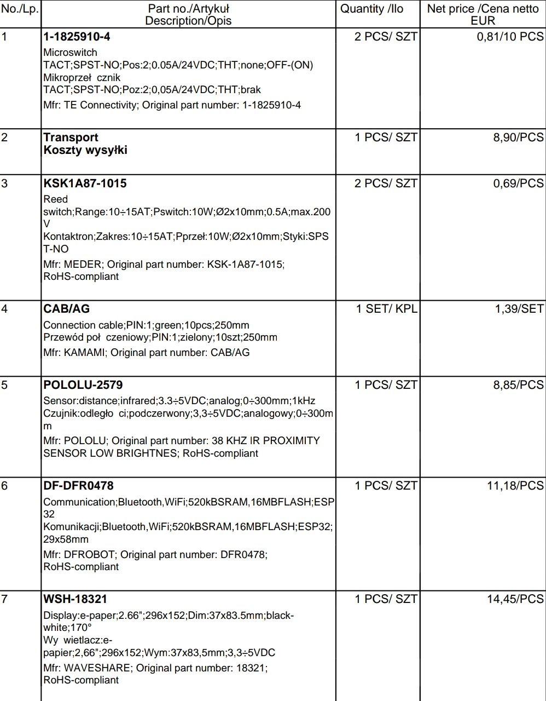

[[25.06.27]]

## Missön steitmentti
----
Halu tietää monta tuntia neulalla x on kuunneltu musiikkia täysin automatisoidusti. Sensorikeskeinen sulautettu järjestelmä tarvitaan, jottei ihmislähtöisen virheen (unohdus) takia neulatunteja merkattaisi joko liikaa tai liian vähän. Helppokäyttöisyys (ihmisrajapinta lähestyy olematonta) on olennaista.

## Vaatimuksia
-----
### Toiminnalliset
- laskee neulatunnit
- pysyy lepotilassa kun ei käytössä
	- herää itsenäisesti kun käyttöönotto havaittu
- osaa erottaa tilanteet anturadatan kautta joissa neula on käytössä niistä, joissa se ei ole käytössä
- yleinen reset toiminnallisuus (ehkä laudassa itsessään)
- neulaspesifi reset toiminnallisuus
- muistitoiminnallisuus, jotta voi vaihtaa eri neulojen välillä
- uusien neulojen lisäys
- Vaikka koko näytön tiedot ei päivittyisi, siinä täytyy silti lukea MCUn tila, eli sleep vai active tai jotain, jotta tietää heti, että toimiiko koko roska ollenkaan. 
- Low power modesta pois interruptilla joko napilla tai sit manaatilla!

### Ei toiminnalliset
- näyttää siedettävältä
    -  puulaatikko
- näyttää neulatunnit ruudulta
- näyttää ruudulla, mikä muistetuista neuloista on valittu
- vie vain vähän virtaa -> mahdollisuus käyttää akkuvirralla?
### Muut
- osat halvalla
	- tilattuna netistä,
	- tehtynä itse,
	- tai kierrätettynä

## Pseudotason toteutussuunnitelmaa + järjestelmäarkkitehtuuri
----
### HW
#### Osia
Katoin kaikki TME.eu:sta, koska se on jees. 
##### MCU
[Arduino nano Esp32](https://www.tme.eu/fi/en/details/abx00092/arduino-solutions/arduino/arduino-nano-esp32-without-headers/)
- pieni
- usb-c 
>The Arduino Nano ESP32 (with and without headers) is a Nano form factor board based on the ESP32-S3
(embedded in the NORA-W106-10B from u-blox®). This is the first Arduino board to be based fully on an ESP32,
and features Wi-Fi®, Bluetooth® LE, debugging via native USB in the Arduino IDE as well as low power 
--[Dokumentaatio](https://www.tme.eu/Document/8204a61f396c62939d5f6480b8506f38/ABX00083-datasheet.pdf)
- vähän ylitappoa tähän tarkoitukseen
[ESp32 wroom 32](https://www.tme.eu/fi/en/details/df-dfr0478/programmable-controllers/dfrobot/dfr0478/)
- vielä halvempi kuin tuo arduino
- nuo pienemmät hilkkeet ovat sinänsä houkuttelevia pienuutensa vuoksi, mut hinta ei ihan kohtaa huokuttelevaisuutta.
##### Näytöt
[E-paperinäyttö waveshare letkuilla ja SPI tsäkällä](https://www.tme.eu/fi/en/details/wsh-18321/e-paper/waveshare/18321/)
- [Dokumentaatio](https://www.tme.eu/Document/e202719f7ea7de7a184ea88bdc3f3b85/WSH-18321.pdf)
 - hyvä dokumentaatio: niil on myös foorumi!
 - Halvahko
 - vie vähän virtaa
[Kaikki E-paperi näytöt TME:ssä](https://www.tme.eu/fi/en/katalog/e-paper_113459/?utm_campaign=The%20Most%20Common%20Displays%20-%20Differences,%20Types%20and%20Applications&utm_medium=description_link&utm_source=youtube.com&utm_term=deNuMAKk4rY)

[tämä on todennäköisesti the valinta](https://www.tme.eu/fi/en/details/wsh-12955/e-paper/waveshare/12955/)
- pienempi kuin esp23 -> helpompi kiinnittää. 
- Harmi ettei saa pidemmällä nauhakaapelilla... mut we will survive
##### Anturit
###### Etäisyys
[Esimerkiksi tämä](https://www.tme.eu/fi/en/details/pololu-2578/distance-sensors/pololu/38-khz-ir-proximity-sensor-high-brightne/)
- Toki näistä mitää tiärä. Ehkä tämä. ehkä joku toinen. Tää on ainakin pieni ja suht halpa.
- Toki virrankulutus ei ole niin merkityksellinen, kun ei hän tuo ole sleepissä päällä ollenkaan.

Käy ilmi että näitä on aika monenlaisia eri tarkotuksiin.
- Myös pelkkä proximity / läheisyys sensori toimisi, kun ei periaatteessa tarvita etäisyysmittaa, vaan pelkkä binäärinen arvo.
	- Läheisyysanturilla tarvitsisi olla tarpeeksi kapea keila jota se haistelee, jotta toimisi tässä tapauksessa
Meidän tarkoitukseen speksit olis 
- tarpeeksi kapea keila ettei tule häröymiä laatikosta, eikä poissiirtyneestä vastapainosta
	- keilaleveyttä voi kompensoida siirtämällä anturia pois päin vastapainosta kun se on kuuntelutilassa -> pitää löytää sweet spot (herkkupiste hehe -> paistopiste)
- levysoittimen kansi on tässä tapauksessa noin 5 cm etäisyydellä äänivarren vastapainosta. Anturin vähin tunnistusetäisyys pitäisi olla siis aika pieni. Tavoite olisi saada laatikosta 2cm paksu tai alle
	- jotta järjestelmä olisi tarpeeksi yleiskelpoinen, haluaisin sen toimivan myös levysoittimissa, missä kannen etäisyys vastapainosta on noin 3 cm.
	- tämä tarkoittaa sitä että vähimmäistunnistusetäisyys pitäisi olla 10 mm tai alle.
	- max tunnistusetäisyys pitäis olla yli 30 mm 
[Tämä](https://www.tme.eu/fi/en/details/pololu-2579/distance-sensors/pololu/38-khz-ir-proximity-sensor-low-brightnes/) on ainoita halpoja, jotka lupaavat tunnistusetäisyyden 0-300mm. 
- Itse kapistus on 0.6" eli noin 1.5 cm pitkä, tätä käytetään pituussuunnassa. 
- Olen skeptinen siitä, että tunnistus lähtisi oikeasti 0mm asti. Kuitenkin, tämä on halpa ja jos toimii niin erinoimainen.


Tarvii lisää tutkimista varsinkin keilaleveyden suhteen [Tässä TMEn kaikki etäisyys ja läheisyysanturit](https://www.tme.eu/fi/en/katalog/robotics-and-prototyping_113324/?queryPhrase=distance%20sensor&page=2)
###### Hallin ilmiö / Reed switch (kielirele!)
<a title="André Karwath aka Aka, CC BY-SA 2.5 &lt;https://creativecommons.org/licenses/by-sa/2.5&gt;, via Wikimedia Commons" href="https://commons.wikimedia.org/wiki/File:Reed_switch_(aka).jpg"></a>

[Tinkerkit hall sensor. Huono dokumentaatio](https://www.tme.eu/fi/en/details/t000070/development-kits-accessories/arduino/tinkerkit-hall-sensor/)
[Esimerkki kielireleestä! Erinomainen dokumentaatio.](https://www.tme.eu/fi/en/details/ksk1a66-1020/reed-sensors/meder/ksk-1a66-1020/)


##### Napit
##### Kotelo
[Pikkupiuhoja](https://www.tme.eu/fi/en/details/mikroe-511-kpl/development-kits-accessories/mikroe/wire-jumper-female-to-female-10pcs/) (Saisinkohan pelastettua mielummin jostain homeisesta USB johdosta)
Kiinnityshärpäkkeitä:
##### Magneetti(tit) hallin anturia varten
[kaikki manaatit](https://www.tme.eu/fi/en/katalog/magnets_100480/?queryPhrase=magnet&page=3)
- tarvisi olla pieni ja halpa. Vois ostaa läjän, kun kyllähän niitä saattaa johonkin muuhunkin tarvita
##### Power
- seinästä tähän hätään
- jos koetaat tarpeelliseksi, niin ehkä 18650 battery shield tmv.

#### Fyysinen asettelu
- Kotelo laatikkomainen
- Hall anturin pitäisi olla tarpeeksi lähellä levylautasta ja magneettia, jotta jännitevaihtelu on tarpeeksi suurta. Osoitettu 90 asteen kulmassa pohjasta tangentiaalisesti levylautaseen.
- Etäisyysanturin pitäisi olla äänivarren vastapainon alla, kun äänivarsi on 'lepotilassa'. Anturi osoittaa ylöspäin.
- Näyttö kiinnitetty kotelon yläpintaan osoittamaan ylöspäin
- Nappi kiinnitetty näytön viereen samalla tavalla.
- mahdollisimman matala, jotta olisi yhteensopiva myös matalampien levylautasten ja äänivarsien kanssa. 
	- Yksi taso koivuvaneria 
- Modulaarisuuden nimissä MCU ja kielirele yhdessä laatikossa ja SPI piuhat toiseen laatikkoon jossa etäisyysanturi. Näin saadaan kaikki hilkkeet järjesteltyä siten, että kielirele on tangentiaalinen levylautaseen nähden ja etäisyysanturi aksonometrinen äänivarteen nähden (isoja sanoja).


5mm kaavapaperi: 
##### Hilkkeiden asennus yksityiskohdat
- Jos laatikko rakennetaan siten, että otetaan koivuvaneria ja leikataqan jyrsimellä se ontoksi, jää pohja aukinaiseksi.
- Pohjan aukon peittäminen kankaalla houkuttelee. Esim BW vihreä kangas toimisi esteettisesti kirkkaan oranssin kanssa. Kankaan pehmeys ja irtonaisuus on myös miellyttävä yksityiskohta.
	- Tässä pitää ottaa huomioon MCUn mahdollinen liiallinen kuumentuminen, jos ilmavirtaa ei ole, tai sitä on liian vähän. 
	- Miten kangas tulisi kiinnittää?
- SPI johdot kahden laatikon välillä voisivat olla oransseja tai vihreitä. Neljä vaakatasossa puhdaslinjaisesti kulkevaa johtoa vaikuttaa miellyttävältä.
	- Koska vihreä kangas -> myös johdot tulee olla vihreitä. 
	-  [TME vihreä johto.](https://www.tme.eu/fi/en/details/cab_ag/development-kits-accessories/kamami/)
- Tavoite olisi, ettei ruuveja näkyisi mihinkään suuntaan.
- Hilkkeiden asennus lootien sisälle menee vähän yli hilseen. 
	- Jos kaiken kokoaa käänteisenä pannukakkuna, että kaikki kiinnitetään laatikon katon alapintaan.
	- Näytön saisi painettua laatikkoa vasten 'jäätelötikulla' poraamalla sen katon alapintaan kiinni tarpeeksi tiukasti.
	- MCU pitäisi varmaankin kiinnittää omilla kiinnitysrööreillään jos sellaiset on + [joillain holkeilla](https://www.tme.eu/fi/en/katalog/mechanical-components_100336/?queryPhrase=metal%20spacer), jotta se saataisiin irti pinnoista.
- Reiät Hilkkeille
	- **Tarviiko kielirele reikää ollenkaan!?** / Kuinka iso manaatti tarvitaan, että kielirele aktivoituu puun läpi? 
	- Nappi tarvitsee reiän. Best case olisi, jos saisi aktuaattorin kiinnitettyä tukevasti lootaan katon alapintaan ja laitettua tulpan reiän kohdalle, joka muodostaisi puisen napin. Puinen kosketuspinta voisi olla vaikka pikaliimalla kiinni aktuaattorissa. Näin kosketuspinta olisi tukevasti kiinni, eikä erillistä namiskuukkelin vakainta tarvittaisi.
	- Etäisyysanturin rööri ylöspäin. Saatetaan tarvia joku linssi estääkseen kakkelin lentämisen sisään, ehkä ei.

#### lähetyslista

Lopulta vähän kalliimpi kuin olin ajatellut, 58 e postitettuna. Toisaalta kaikki hinnat oikein järkeviä, en ollut ehkä vaan ajatellut kokonaiskuvaa 😅.
- En ostanut nyt akkua tätä varten, katsotaan sitten syssymmällä.
- pienempi WSH-12955 näyttö oli loppuunmyyty, valitettavasti.

### SW
#### Ympäristö
En jaksa enää kikkalla arduino IDE:n kanssa -> siis otetaan käyttöön VS code
- platformIO tai
- Arduino Extension

Ubuntu 24
#### Näyttö
[Näytön dokumentaatio taas](https://www.tme.eu/Document/e202719f7ea7de7a184ea88bdc3f3b85/WSH-18321.pdf)
[Wavesharen foorumi]
[Wavesharen
[Youtube video: esp32 waveshare epaper tutorial](https://youtu.be/El38zVmog14?si=ud3ozTBkW0lQLSYN)

#### Logiikka
I/O
Bool releK = gpio(kielirele)
Int antuE = gpio(etäisyysanturi)
Scr näyttö = output(näyttö)

Näytön printit
Str tunnit = "{tunnit_int} h"
Str päivitysaika = current_time(mm:hh)
Str aktiivinen = "käytössä" if full_active() else "levossa"

Tuntien säilöminen
Bool to_file()
Bool from_file()

Aktiivisuus/epäaktiivisuus 
```c
bool full_active() {True if releK_active() && antuE_active() else False}
int releK_active()
int antuE_active()
```


